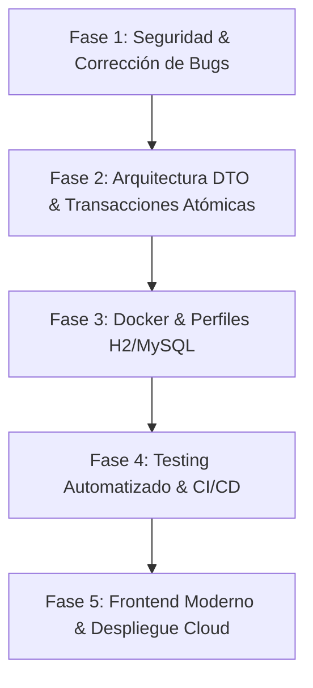

# 📦 Contexto del Proyecto: Sistema de Gestión de Bodegas (WMS)

**Documento de Diagnóstico Técnico, Estado del Desarrollo y Roadmap para Portafolio**  
*Autores Originales:* David Alejandro Ardila Cardozo & Nicolás Felipe Arrubla Chaux  
*Fecha de Análisis:* Septiembre 2026  
*Tecnologías Base:* Java 17 | Spring Boot 3.5.7 | Spring Security & JWT | Spring Data JPA | MySQL 8  

---

## 1. 🎯 Resumen Ejecutivo y Objetivo

El proyecto **Sistema de Gestión de Bodegas** es una aplicación orientada a la gestión logística y control de inventarios empresariales (*Warehouse Management System - WMS*). Su núcleo implementa la trazabilidad de existencias en múltiples bodegas, movimientos de entrada, salida y transferencias, auditoría automática de operaciones y control de acceso basado en roles (RBAC).

**Meta Principal**: Transformar este proyecto desde un prototipo académico/funcional hacia un **proyecto de portafolio de nivel profesional (Mid-Level Developer)**, optimizando la seguridad, arquitectura, calidad de código, cobertura de pruebas, contenedorización (Docker) y experiencia de usuario.

---

## 2. 🔍 Diagnóstico del Estado Actual del Desarrollo

### 2.1. Lo que está implementado y funciona
- **Estructura Modular Spring Boot**: Arquitectura en capas (`entities`, `repository`, `services`, `controllers`, `security`, `config`, `exception`).
- **Compilación Exitosa**: El proyecto compila limpiamente bajo **Java 17** y **Maven 3.9+** (`.\mvnw.cmd test-compile` exitoso).
- **Modelo de Datos Relacional**:
  - `Usuario`: Gestión de credenciales y roles (`ADMIN`, `ENCARGADO`, `OPERADOR`).
  - `Bodega`: Capacidad máxima, ubicación y encargado asignado.
  - `Producto`: Stock actual, precio, categoría y asignación a bodega.
  - `MovimientoInventario` y `DetalleMovimiento`: Registro de operaciones de inventario.
  - `Auditoria`: Trazabilidad de operaciones CRUD con snapshots JSON de valores anteriores y nuevos.
  - `IntentoFallido`: Registro de transacciones denegadas (por stock insuficiente o capacidad excedida).
- **Lógica de Validación de Inventario**: Reglas de negocio para validar stock disponible en salidas y capacidad en bodegas destino.
- **Documentación Swagger/OpenAPI**: Base configurada con Springdoc OpenAPI en `/swagger-ui.html`.
- **Frontend Prototípico**: Vistas HTML/CSS y JavaScript vanilla con dashboards diferenciados por rol.

---

### 2.2. Deuda Técnica y Vulnerabilidades Críticas Identificadas

| Componente | Hallazgo Crítico / Riesgo | Impacto |
| :--- | :--- | :--- |
| **Spring Security** | `SecurityConfig.java` tiene `.requestMatchers("/api/**").permitAll()` y `.anyRequest().permitAll()`. Todo el sistema está abierto sin autenticación obligatoria. | 🔴 **Crítico (Vulnerabilidad)** |
| **Registro de Usuarios** | `POST /api/auth/register` permite enviar `"rol": "ADMIN"` en el cuerpo JSON sin restricción, permitiendo a cualquiera crearse una cuenta de Administrador. | 🔴 **Crítico (Escalamiento de Privilegios)** |
| **Fuga de Credenciales** | Endpoints de usuarios (`GET /api/usuarios`) retornan la entidad `Usuario` completa incluyendo el hash de la contraseña en el JSON. | 🔴 **Alto (Fuga de Datos Sensibles)** |
| **Bug de Encriptación** | `UsuarioService.guardar()` re-encripta la contraseña incondicionalmente. Al actualizar el nombre de un usuario ya existente, su hash se encripta dos veces y nunca más puede iniciar sesión. | 🟠 **Alto (Bug Funcional)** |
| **Transaccionalidad en Movimientos** | El frontend ejecuta primero `POST /api/movimientos` y luego en una llamada HTTP separada `POST /api/detalle-movimientos`. Si la segunda falla, queda una cabecera huérfana y el stock se desfasa. | 🟠 **Alto (Inconsistencia de Datos)** |
| **Exposición Directa de Entidades** | Los controladores usan entidades JPA directamente en `@RequestBody` y `@ResponseBody` sin DTOs (Data Transfer Objects), arriesgando recursión infinita y Mass Assignment. | 🟡 **Medio (Arquitectura)** |
| **Auditoría Manipulable** | Existe un endpoint `POST /api/auditorias` público donde cualquier cliente HTTP puede inyectar registros falsos de auditoría. | 🟡 **Medio (Integridad de Auditoría)** |
| **Secrets Hardcodeados** | `JwtUtil.java` tiene una clave secreta fija en el código en lugar de inyectarla desde variables de entorno o `application.properties`. | 🟡 **Medio (Configuración)** |
| **Despliegue Antiguo (WAR)** | Empaquetado en `.war` diseñado para copiarse manualmente a una carpeta `C:\tomcat10` con scripts `.bat`. Hoy en día el estándar de la industria es `.jar` autocontenido y Docker. | 🟡 **Medio (DevOps)** |
| **Cobertura de Pruebas (~0%)** | Solo existe un test vacío `contextLoads()`. No hay pruebas unitarias con JUnit/Mockito ni tests de integración para endpoints clave. | 🔴 **Crítico para Portafolio** |
| **Frontend Vanilla Acoplado** | Código JS duplicado en 3 archivos distintos con `API_URL = 'http://localhost:8080/api'` hardcodeado, lo cual rompe si se despliega en cualquier servidor o dominio web. | 🟡 **Medio (Frontend)** |

---

## 3. 🚀 Roadmap de Transformación para Portafolio y Hoja de Vida

Para que este proyecto se convierta en una pieza estrella de tu CV que impresione a reclutadores y líderes técnicos, se recomienda seguir este plan por fases:

### 🔹 Fase 1: Blindaje de Seguridad y Fixes Urgentes
1. **Activar Spring Security Real**:
   - Proteger todos los endpoints bajo `/api/**` con JWT.
   - Dejar públicos únicamente `/api/auth/**`, `/swagger-ui/**`, `/v3/api-docs/**` y assets estáticos.
   - Implementar control de acceso granular con `@PreAuthorize("hasRole('ADMIN')")`, `@PreAuthorize("hasAnyRole('ADMIN', 'ENCARGADO')")`.
2. **Corrección del Registro**:
   - Forzar que el auto-registro solo asigne rol `OPERADOR`. La creación de `ADMIN` y `ENCARGADO` debe ser exclusiva para administradores autenticados.
3. **Corrección de `UsuarioService`**:
   - Evitar doble encriptación de claves y proteger el endpoint de auditorías (eliminar `POST /api/auditorias` externo).
4. **Configuración de JWT**:
   - Inyectar el secreto desde `@Value("${jwt.secret}")` y soportar variables de entorno.

---

### 🔹 Fase 2: Excelencia Arquitectónica (Clean Code & DTOs)
1. **Adopción Completa del Patrón DTO**:
   - Separar modelos de dominio de modelos de transferencia: `UsuarioRequestDTO`, `UsuarioResponseDTO` (sin campo password), `BodegaDTO`, `ProductoDTO`, `MovimientoRequestDTO`.
2. **Movimientos de Inventario Atómicos**:
   - Endpoint transaccional único: `POST /api/movimientos` que reciba cabecera + lista de detalles en un solo payload.
   - Si falla una validación de stock o capacidad, toda la transacción se revierte con `@Transactional(rollbackFor = Exception.class)`.
3. **Paginación y Filtrado Dinámico**:
   - Modificar consultas de listados masivos (`/api/movimientos`, `/api/productos`, `/api/auditorias`) usando `Pageable` de Spring Data (`Page<T>`).
4. **Swagger UI con Autenticación JWT**:
   - Configurar `SecurityScheme` Bearer JWT en OpenAPI para permitir probar endpoints autenticados directamente desde el navegador.

---

### 🔹 Fase 3: Modernización DevOps y Base de Datos
1. **Empaquetado JAR y Perfiles de Entorno**:
   - Cambiar empaquetado de `<packaging>war</packaging>` a `<packaging>jar</packaging>`.
   - `application-dev.properties`: Base de datos H2 en memoria para poder probar la aplicación en 5 segundos con un solo comando sin depender de tener MySQL instalado localmente.
   - `application-prod.properties`: Conexión a MySQL / PostgreSQL mediante variables de entorno (`SPRING_DATASOURCE_URL`, etc.).
2. **Dockerización Completa**:
   - `Dockerfile` multi-stage build optimizado para Spring Boot.
   - `docker-compose.yml`: Levanta en un solo paso el backend Spring Boot + la base de datos MySQL 8 con volúmenes persistentes y datos de prueba precargados.

---

### 🔹 Fase 4: Testing Automatizado y CI/CD
1. **Tests Unitarios**:
   - Pruebas con **JUnit 5** y **Mockito** para la lógica de negocio de movimientos (`DetalleMovimientoService`, validación de capacidad, stock insuficiente, cálculo de stock).
2. **Tests de Integración**:
   - Pruebas de controladores con `@AutoConfigureMockMvc` y base de datos de test, validando respuestas HTTP 200, 400, 401, 403 y 404.
3. **Pipeline CI/CD**:
   - GitHub Actions workflow (`.github/workflows/build-and-test.yml`) que compile el código, ejecute las pruebas y verifique el linter en cada pull request o commit.
   - Añadir insignia (*Badge*) de estado de compilación al `README.md`.

---

### 🔹 Fase 5: Experiencia de Usuario (UI) y Publicación
1. **Interfaz Web de Impacto**:
   - **Opción Recomendada**: Desarrollar un cliente Frontend moderno con **React + Vite + Tailwind CSS / Shadcn** o pulir integralmente la interfaz existente.
   - Añadir visualización analítica: gráficos de existencias por bodega, alertas en tiempo real de bajo stock, y exportación de reportes a PDF o Excel.
2. **Despliegue Público Gratuito**:
   - Desplegar la API en plataformas en la nube como **Railway**, **Render** o **Fly.io**.
   - Incluir enlace a la demo en vivo y credenciales de prueba en el `README.md`.

---

## 4. 📌 Cómo Presentar Este Proyecto en tu Hoja de Vida

### Ejemplo de Descripción para CV / LinkedIn:

> **Sistema de Gestión de Inventarios y Bodegas (WMS) | Full-Stack Developer**  
> *Java 17, Spring Boot 3, Spring Security, JWT, JPA/Hibernate, MySQL, Docker, REST API, Swagger*
> - Diseñó e implementó una API RESTful empresarial para la trazabilidad y movimiento de existencias entre múltiples bodegas, garantizando consistencia transaccional con ACID.
> - Implementó autenticación stateless basada en JWT y control de acceso basado en roles (RBAC) con Spring Security.
> - Desarrolló un motor de auditoría automatizada mediante Entity Listeners JPA y registro asíncrono de transacciones e intentos fallidos.
> - Contenedorizó la solución con Docker y Docker Compose, logrando despliegues reproducibles con perfiles de desarrollo y producción.
> - Implementó cobertura de pruebas unitarias e integración con JUnit 5 y Mockito bajo un pipeline CI/CD en GitHub Actions.

---

*Archivo generado automáticamente para guiar las siguientes fases de desarrollo y optimización.*
